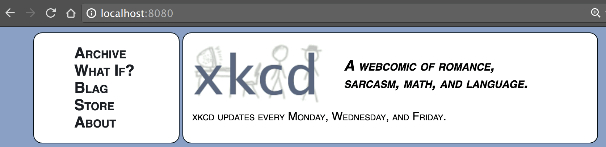
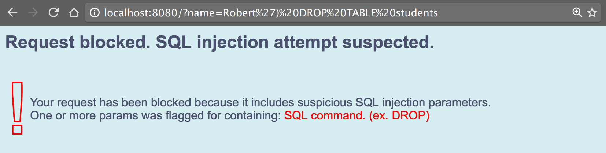

##about
A simple proxy that scans for SQL injection attacks and blocks suspicious requests. Have a vulnerable legacy application without resources or source to update it? Insert this proxy between your web server and your application. All HTTP methods supported.

##usage
1. _prerequisites: [Node JS](https://nodejs.org) installed and on the system path_
2. clone the repository: `git clone git@github.com:mikerodonnell/node_js_anti_sql_injection_proxy.git`
3. edit config.js with your application base url, or any non-SSL website just to test. example: `config.target_host="http://www.xkcd.com"`
4. from within the `node_js_anti_sql_injection_proxy` directory, install dependencies: `npm install`
5. still within `node_js_anti_sql_injection_proxy`, start the proxy: `node main/proxy.js`
6. still within `node_js_anti_sql_injection_proxy`, run unit tests: `npm test`
7. verify benign requests work through the proxy (default port is 8080): `http://localhost:8080`

8. verify suspicious requests are blocked: `http://localhost:8080?name=Robert') DROP TABLE students`

##implementation notes
* plain Node Javascript is used to keep things lightweight; no Express. the minimal view rendering needed is handled directly with EJS.
* the HTML blocked request page shown above contains no links to CSS, images, or other static assets. identifying and handling (rather than passing-through) static asset requests coming back into the proxy from the browser is do-able, but avoidable.

##tools used
* [EJS](http://ejs.co/) _for dynamic view rendering_
* [mocha](https://mochajs.org/) _unit testing framework_
* [supertest](https://www.npmjs.com/package/supertest) _for REST testing_
* [chai](http://chaijs.com) _for assertions_

##TODO
* SSL support
* additional SQL injection patterns
* error handling -- unreachable host, HTTP method not supported, etc.
